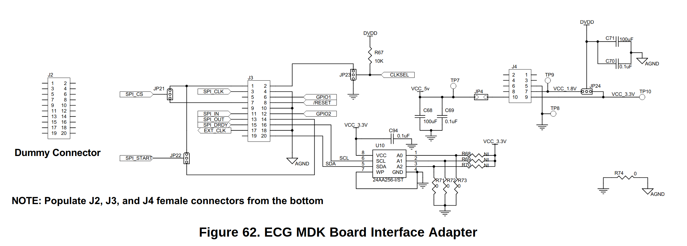

# ADS1299-x-MicroPython-Module

This is a small `MicroPython` module for configuring and using the Texas Instruments ADS1299 8-channel, 24-bit, low-noise analog-to-digital converter for biopotential measurements.

> [!IMPORTANT]
> This project ONLY involves the development of the module that establishes the connection between the ESP32 and the ADS1299 board. Therefore, data visualization or transmission is not covered in the documentation. However, if you have any questions about how to integrate this module into your projects, feel free to comment in the [issues](https://github.com/VicoHBB/ADS1299-x-MicroPython-Module/issues) section. I will be happy to assist you.

---

<!--toc:start-->
- [ADS1299-x-MicroPython-Module](#ads1299-x-micropython-module)
- [Dependencies](#dependencies)
- [How to use?](#how-to-use)
  - [Before implement it](#before-implement-it)
  - [On you code project](#on-you-code-project)
  - [Flash to the board](#flash-to-the-board)
- [How to Makefile](#how-to-makefile)
- [How to test module](#how-to-test-module)
  - [What tests do?](#what-tests-do)
- [To-Do](#to-do)
- [References](#references)
<!--toc:end-->

---

# Dependencies
* Text editor, but also you can use and IDE like [thonny](https://github.com/thonny/thonny) or [Mu](https://codewith.mu/)
* [ampy](https://github.com/scientifichackers/ampy)
* [make](https://www.gnu.org/software/make/)
* [matplotlib](https://pypi.org/project/matplotlib/)
* [rshell](https://github.com/dhylands/rshell)

# How to use?

## Before implement it
1. First and foremost, please review the [ADS1299 Datasheet](https://www.ti.com/lit/ds/symlink/ads1299.pdf?ts=1680289538117&ref_url=https%253A%252F%252Fwww.ti.com%252Fproduct%252FADS1299%253Futm_source%253Dgoogle%2526utm_medium%253Dcpc%2526utm_campaign%253Dasc-null-null-GPN_EN-cpc-pf-google-wwe%2526utm_content%253DADS1299%2526ds_k%253DADS1299%2526DCM%253Dyes%2526gclsrc%253Dds%2526gclsrc%253Dds) to learn more about the integrated circuit, its limitations, configurations. Please focus on following sections:

    * **Section 7.7: Switching Characteristics: Serial Interface** on page `12` is important to review, especially the following note:

    > SPI settings are CPOL = 0 and CPHA = 1.

    * **Section 9.6: Register Maps** on page `44` of the datasheet to learn how to configure the registers. The module makes it easy to handle this configuration, but please ensure you choose the best settings based on your specific needs. For a quick consult you can find [Register Maps](./docs/Register_Maps.png) on docs.

2. For the second step, please refer to the [EEG Front-End Performance Demonstration Kit](https://www.ti.com/lit/ug/slau443b/slau443b.pdf?ts=1680289719540&ref_url=https%253A%252F%252Fwww.google.com%252F) to understand the board configuration and all its connections. In this document, you will find the following diagram:




## On you code project

1. Import the necessary modules:
```python
from machine import Pin, SPI
from ads1299 import ADS1299
# Do not import as
# from module.ads1299 import ADS1299
```


2. Initialize the `SPI` pins, chip select `CS` pin, and create an instance of the `ADS1299` class:
```python
spi = SPI(1, sck=Pin(2), mosi=Pin(3), miso=Pin(4))  # Initialize SPI pins
cs = Pin(5, Pin.OUT)  # Initialize CS pin

adc = ADS1299(spi, cs, clock_en=True, data_rate=ADS1299.SAMPLE_RATE_250)  # Create ADS1299 instance
```

3. Initialize the ADC by calling the `init()` method:
```python
adc.init()  # Initialize the ADC
```

On this point you can read and write the register of `ADS1299`.

4. Configure the channels by calling the `config_all_channels()` method, specifying the desired gain, SRB2 connection, and multiplexing settings:
```python
adc.config_all_channels(gain=ADS1299.GAIN_24)  # Configure all channels with a gain of 24
```

5. Enable continuous reading of the data by calling the `enable_read_continuous()` method:
```python
adc.enable_read_continuous()  # Enable continuous reading of the data

```

6. Read the data from all channels by calling the `read_channels_continuous()` method:
```python
data = adc.read_channels_continuous()  # Read the data from all channels in continuous mode
```

## Flash to the board
1. Upload the `ads1299.py` file to the `ESP32` memory using `ampy`:
```python
ampy -p <USB_PORT> put module/ads1299.py
```
If you are using `Thonny` or `Mu` Just move the file to the board using the mouse

2. Now you can run or flash you main program with following commands:
```python
ampy -p <USB_PORT> run your_main.py # for run without flash the borad
ampy -p <USB_PORT> put your_main.py # for flash the borad
```


# How to Makefile


# How to test module

Be sure that everything is connecting properly and depending on the context run the following commands

```sh
make test1 # If you just want to test one slave conected
make test1 # If you just want to test two slaves connected
```

## What tests do?

* `make test1`: The `1_slave_test.py` test script is designed to test the functionality of the ADS1299 ADC driver with a single slave device (ADS1299).

    - Flashes the `ads1299.py` module to the MicroPython board using the `ampy` tool.
    - Runs the `1_slave_test.py` test script on the MicroPython board.
    - Copies the `signals.json` file from the Pyboard to the local machine using `rshell`.
    - Runs a Python script (`plot.py`) to plot the data from the `signals.json` file.
    - Removes the `signals.json` file from the local machine.

* `make test2`: The `2_slaves_test.py` test script is designed to test the functionality of the ADS1299 ADC driver with multiple slave devices (ADS1299s).

    - Flashes the `ads1299.py` module to the MicroPython board using the `ampy` tool.
    - Runs the `2_slaves_test.py` test script on the MicroPython board.
    - Copies the `signals.json` file from the Pyboard to the local machine using `rshell`.
    - Runs a Python script (`plot.py`) to plot the data from the `signals.json` file.
    - Removes the `signals.json` file from the local machine.

Both `test1` and `test2` recipes are useful for testing the ADS1299 ADC driver with different scenarios, such as single-slave or multiple-slave configurations. The test scripts (`1_slave_test.py` and `2_slaves_test.py`) should be implemented in the `tests/` directory, and the `plot.py` script should be implemented in the same directory to visualize the test results.


# To-Do
- [ ] Complete the documentation.
- [ ] Migrate this project to FreeRTOS.

# References
- [MicroPython ESP32](https://micropython.org/download/esp32/)
- [MicroPython documentation](https://docs.micropython.org/en/latest/)
- [Getting started with MicroPython on the ESP32](https://docs.micropython.org/en/latest/esp32/tutorial/intro.html?highlight=esp32)
- [ADS1299 TI](https://www.ti.com/product/ADS1299?ds_k=ADS1299&DCM=yes)
- [ADS1299-x Datasheet](https://www.ti.com/lit/ds/symlink/ads1299.pdf?ts=1680289538117&ref_url=https%253A%252F%252Fwww.ti.com%252Fproduct%252FADS1299%253Futm_source%253Dgoogle%2526utm_medium%253Dcpc%2526utm_campaign%253Dasc-null-null-GPN_EN-cpc-pf-google-wwe%2526utm_content%253DADS1299%2526ds_k%253DADS1299%2526DCM%253Dyes%2526gclsrc%253Dds%2526gclsrc%253Dds)
- [EEG Front-End Performance Demonstration Kit](https://www.ti.com/lit/ug/slau443b/slau443b.pdf?ts=1680289719540&ref_url=https%253A%252F%252Fwww.google.com%252F)
